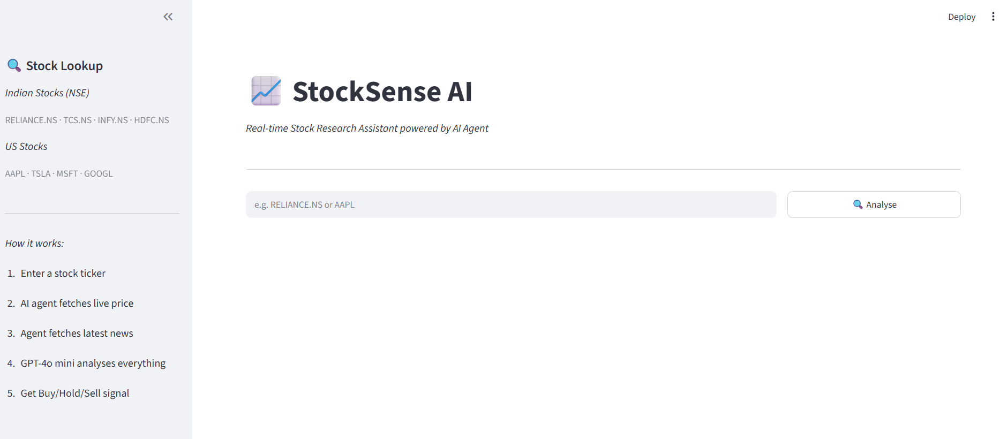

# stocksense-ai
🤖 Agentic stock research assistant — LangChain ReAct agent that autonomously fetches live price data, analyses news sentiment and generates Buy/Hold/Sell signals using GPT-4o mini | LangChain · yfinance · NewsAPI · FastAPI · Streamlit

## 📌 What is StockSense AI?

StockSense AI is an autonomous AI agent that analyses any stock in real time.
Enter a ticker symbol and the agent automatically:

- Fetches live price data and key fundamentals using yfinance
- Retrieves the latest news using DuckDuckGo Search
- Analyses sentiment and generates a structured research report
- Produces a clear Buy / Hold / Sell signal with reasoning

No manual research. No static data. Just real-time AI-powered insights.

---

## 🖥️ Screenshots

---

## ⚙️ Tech Stack

| Layer | Technology |
|---|---|
| AI Agent | LangChain Agent with tool calling |
| LLM | OpenAI GPT-4o mini |
| Stock Data | yfinance (Yahoo Finance) |
| News | DuckDuckGo Search (ddgs) |
| Backend API | FastAPI |
| Frontend | Streamlit |
| Environment | python-dotenv |

---

## 🏗️ Architecture
Browser / API Client
↓
app.py (Streamlit UI)
↓ HTTP POST /analyse
api.py (FastAPI — port 8000)
↓
agent.py (LangChain Agent)
↓              ↓
get_stock_info      fetch_news
(yfinance)          (ddgs)
↓              ↓
GPT-4o mini synthesises
↓
Price Summary + News Summary
Sentiment + Buy/Hold/Sell Signal

## 📁 Project Structure
stocksense-ai/
├── agent.py        # LangChain agent with tools
├── api.py         # FastAPI REST API
├── app.py          # Streamlit UI
├── .env            # API keys (never committed)
├── .gitignore      # Ignores venv, .env, pycache
├── requirements.txt
└── README.md

## 🚀 Run Locally

### 1. Clone the repo
git clone https://github.com/your-username/stocksense-ai.git
cd stocksense-ai

### 2. Create and activate virtual environment
python -m venv venv
venv\Scripts\activate        # Windows
source venv/bin/activate     # Mac/Linux

### 3. Install dependencies
pip install -r requirements.txt

### 4. Add your OpenAI API key
Create a .env file:
OPENAI_API_KEY=sk-your-key-here

### 5. Start FastAPI backend
uvicorn main:app --reload

### 6. Start Streamlit frontend
streamlit run app.py

## 💡 Key Concepts
Agentic AI — Agent autonomously decides which tools to call and in what order
Tool Calling — GPT-4o mini natively calls yfinance and news tools
Real-time Data — Live price and news fetched on every request
Decoupled Architecture — Streamlit consumes FastAPI as a REST client

## 🔮 Future Improvements
[ ] Add LangGraph for multi-agent architecture
[ ] Add portfolio analysis — analyse multiple stocks at once
[ ] Add historical price charts
[ ] Add email alerts for Buy signals
[ ] Deploy on AWS / GCP
[ ] Add support for crypto tickers

## 👨‍💻 Author
Built by Aanish — Software Engineer transitioning into GenAI/Agentic AI Engineering.